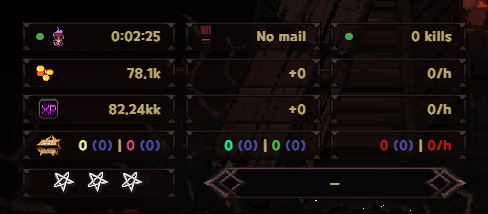
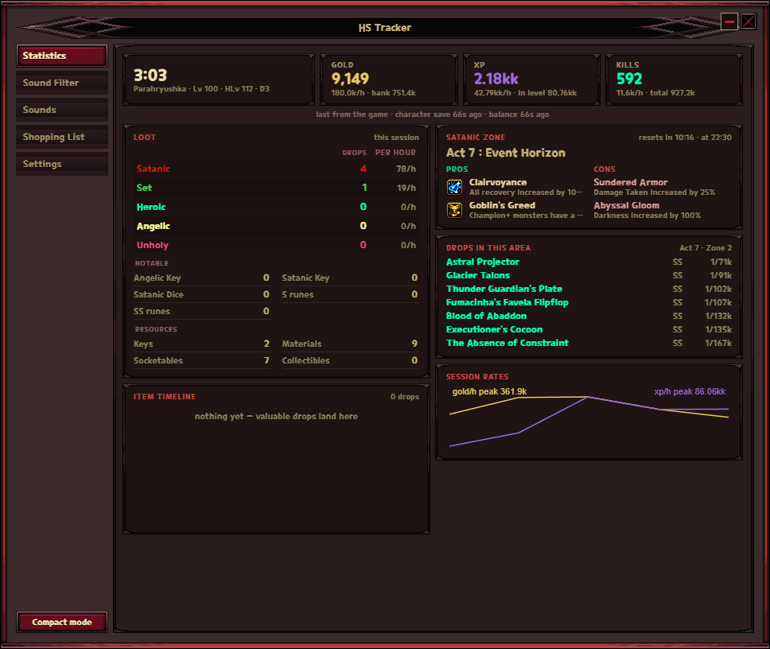
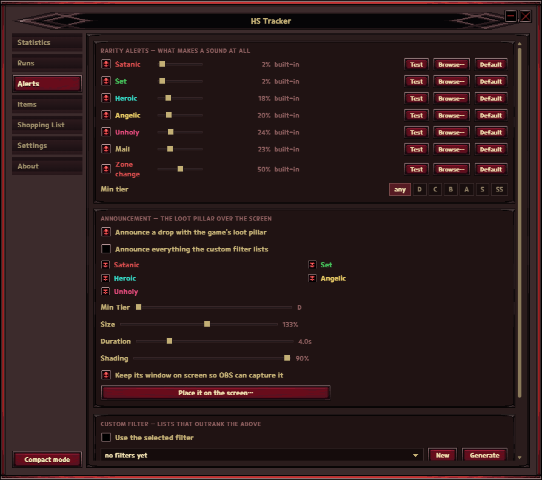
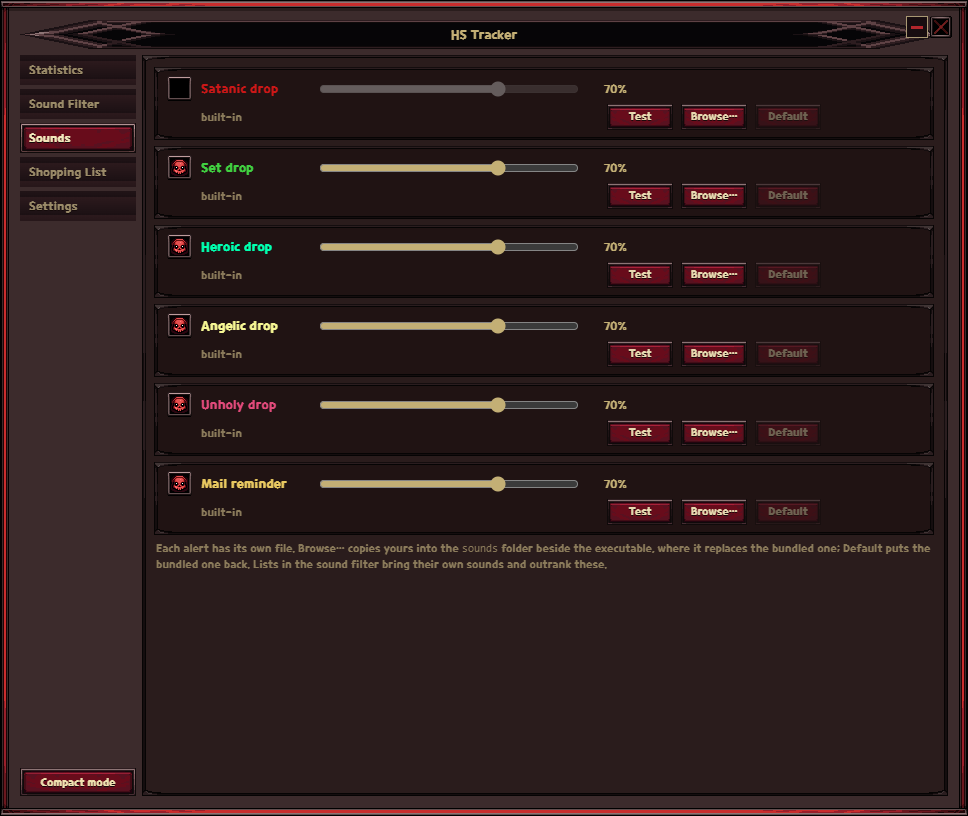
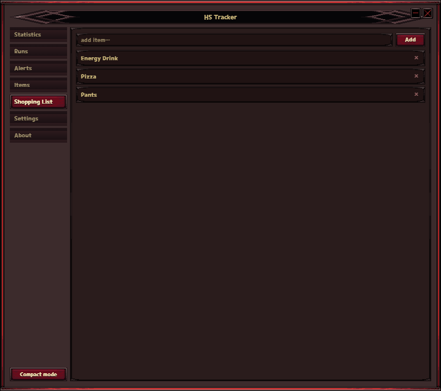
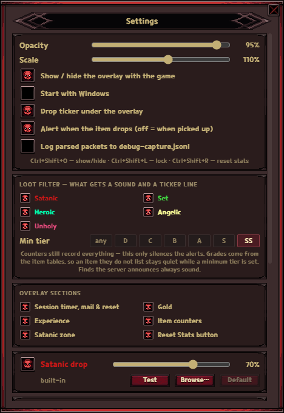
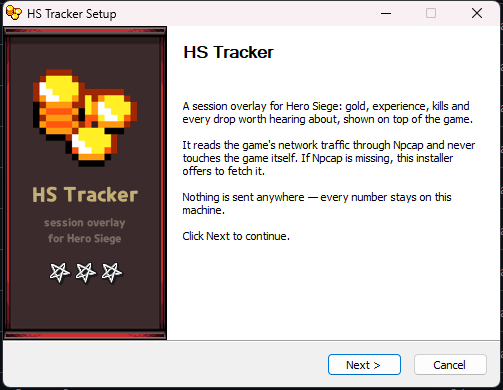

# HS Tracker

A session tracker for **Hero Siege**. It has two faces: a dashboard to set
things up and read the run, and a small always-on-top overlay — both drawn from
the game's own UI art.

It reads the game's network traffic (via Npcap) and reports gold, experience,
kills, item drops by rarity, and the current Satanic Zone with its buffs and
debuffs. It never touches the game process, never injects anything and never
sends data anywhere — everything stays on your machine.



## Features

- **Compact overlay** — session timer, mail, gold, XP, item counters by rarity
  and the active Satanic Zone. Frameless, always on top, drag anywhere.
- **Lock mode** — pin the overlay and it becomes click-through, so it never
  eats a click meant for the game. The lock button itself stays clickable.
  Over a running game the frame also disappears, leaving only the numbers.
- **Drop ticker** — valuable drops appear as a short list under the overlay
  with the item's real name, then fade away.
- **Sound alerts** — a separate configurable sound per rarity (Satanic, Set,
  Heroic, Angelic, Unholy) plus a mail reminder. Alerts fire the moment an item
  hits the ground, not when you pick it up.
- **Sound filters** — named lists of specific items, each with its own sound,
  that outrank the rarity alerts. Generate them from drop rates, share them as
  a file, or build your own.
- **Statistics** — a session overview: gold, xp and kills with their per-hour
  rates, drops by rarity, notable finds (Angelic Key, Satanic Dice, S/SS runes
  …), what can drop in the area you are standing in, the Satanic Zone with a
  countdown to the next rotation, and a timeline of named drops.
- **Shopping list** — a scratchpad where clicking an entry copies it to the
  clipboard, ready to paste into the market search.
- Global hotkeys, autostart, per-section visibility, opacity and scale.

## The dashboard

One window, a section per job, and a **Compact mode** button at the bottom of
the sidebar that folds it all back into the overlay. Drag it by any empty spot,
resize it from any edge — the size and position come back next launch.

### Statistics



The run at a glance. Gold, xp and kills carry over from the last session, so a
restart does not show zeros until the game next saves. "Drops in this area"
lists what is tied to the zone you are in — most items drop anywhere, a few
hundred do not, and that is the difference between farming here on purpose and
farming here out of habit.

### Sound Filter



The top half is the plain rarity alerts and the minimum grade. Below it are
filters: a filter is a pack of lists, a list is a set of items with a sound and
a volume of its own, and an item on a list is announced by that list whatever
the rarity switches say. **Generate** builds a filter from the datamined drop
rates — S and SS gear split into common, rare and chase bands, with Angelic and
Unholy in lists of their own. **Import…** / **Export…** move a whole filter,
sounds included, as one file.

### Sounds, Shopping List, Settings

| Sounds | Shopping List |
| --- | --- |
|  |  |



## Install

Grab the package for your system from the [Releases](../../releases) page.

### Windows

Run the installer. It installs for the current user, so Windows never asks for
administrator rights.



HS Tracker needs [Npcap](https://npcap.com), the packet capture driver, to read
the game's traffic. The installer checks for it and, when it is missing, offers
to download the official installer from npcap.com and run it — its defaults are
fine. Npcap itself is not bundled: its free edition may not be redistributed
inside another installer.

Everything the app writes (settings, carried totals, shopping list, custom
sounds) lives next to the executable, so the whole folder can be copied to
another machine. Windows 10 or 11 is required.

### Linux

The `.deb` is the easy one on Debian, Ubuntu and their relatives: it pulls in
libpcap and the tray library, and grants the binary the capture right on
install, so it works straight away.

```bash
sudo apt install ./hs-tracker_0.9.5_amd64.deb
```

The AppImage runs anywhere but cannot grant itself that right, so give it once:

```bash
chmod +x HS\ Tracker_0.9.5_amd64.AppImage
sudo setcap cap_net_raw,cap_net_admin=eip HS\ Tracker_0.9.5_amd64.AppImage
```

Settings and the rest live in `~/.config/hs-tracker`. Log in to an **X11**
session: the overlay needs click-through windows, window positioning and global
hotkeys, none of which Wayland gives an application — see the note under
[Building → Linux](#linux-1).

## Usage

The tray icon is the control centre: left click hides whatever is on screen and
brings back the face that was up last. Right clicking the overlay opens the same
menu.

| Action | How |
| --- | --- |
| Show / hide | tray click, or `Ctrl+Shift+O` |
| Overlay ⇄ dashboard | **Compact mode** in the sidebar, **Dashboard** in the overlay menu, or the tray menu |
| Lock / unlock the overlay | lock icon on hover, or `Ctrl+Shift+L` |
| Reset session | overlay button, tray menu, or `Ctrl+Shift+R` |

Counting starts once the game sends an account packet, which happens shortly
after you enter a zone. Gold, experience and kills only travel when the game
saves the character or banks gold, so between saves those three sit still while
drops keep arriving — that is the protocol, not a stuck counter.

### Alerts

Every rarity has its own channel with an on/off switch, volume and a preview.
**Browse…** copies your own file (mp3/wav/ogg/flac) into `sounds\` next to the
executable, where it overrides the bundled one; **Default** removes it again.

**Min tier** narrows the alerts further. The game grades items D to SS, and the
setting is a floor: at `S`, an S or SS drop still sounds and everything below it
stays quiet. Grades come from the item tables, so an item they do not list makes
no sound while a minimum is set. The counters record every drop either way — the
minimum silences alerts, it does not hide anything.

Lists in the sound filter are exempt: an item on a list is announced by that
list's own sound whatever the rarity switches and the minimum grade say.

## How it works

Hero Siege talks to its servers over plain TCP. HS Tracker finds the game
process, learns which server addresses it is connected to, and captures those
conversations with Npcap (libpcap elsewhere). Messages arrive as JSON, base64
blobs or query strings, sometimes several per packet and sometimes split across
packets, so the reader reassembles them before parsing.

## Building

```bash
npm install
npm start          # dev run
npm run release    # installer in src-tauri/target/release/bundle/nsis
cd src-tauri && cargo test
```

`package.json` owns the version. `npm run ver 1.1.0` writes it into
`tauri.conf.json` and `Cargo.toml` as well, and `npm run release` runs that
first, so the installer, the crate and the tag can never disagree.

Rust (MSVC toolchain) and Node are required. The `tauri-dev.cmd` /
`tauri-release.cmd` wrappers load the Visual Studio environment first, because
linking fails without it. The Npcap SDK import libraries are vendored in
`src-tauri/npcap-sdk`; `wpcap.dll` is delay-loaded, so the app starts and
reports the problem instead of crashing when Npcap is absent.

### Linux

Releases carry a `.deb` and an AppImage beside the Windows installer, and the
workflow builds and tests both every time it runs. The Linux build is younger
than the Windows one — it is the same code, but far fewer hours of play behind
it, so bug reports are welcome. Building it yourself:

```bash
sudo apt install build-essential curl wget file patchelf \
                 libwebkit2gtk-4.1-dev libgtk-3-dev libayatana-appindicator3-dev \
                 librsvg2-dev libpcap-dev
npm ci && npm run build
npx tauri build --bundles deb,appimage
```

Capture needs `cap_net_raw`. The `.deb` grants it on install
([installer/deb-postinst.sh](src-tauri/installer/deb-postinst.sh)); an AppImage
cannot, so there it is one manual line:

```bash
sudo setcap cap_net_raw,cap_net_admin=eip ./HS-Tracker.AppImage
```

Settings, carried totals and custom sounds
live in `$XDG_CONFIG_HOME/hs-tracker` instead of beside the executable, since
`/usr/bin` and a mounted AppImage are read-only. Autostart is a `.desktop` file
in `~/.config/autostart` instead of a registry value.

What the desktop has to provide: **X11**. The overlay leans on click-through
windows, programmatic positioning, the cursor position and global hotkeys, none
of which Wayland hands to an application. Under Wayland the dashboard still
works, but the overlay becomes an ordinary window; if it is locked there, the
tray menu is the way back out. The tray itself is an AppIndicator, which only
opens its menu — the left-click toggle is Windows-only.

### Regenerating assets

`tools/` holds the generators, none of which run during a normal build:

- `fetch_items.py` — pulls the datamined item table (identity, rarity, grade)
  from hero-siege-helper into `tools/data/helper/items.json`.
- `gen_items.py` — rebuilds `src/items.js` and `src-tauri/src/items.rs` from
  that table plus the game's own `translationsItem.csv`, so names read exactly
  as they do in game. Point `HERO_SIEGE_BIN` at the install if it is not on the
  default path.
- `yytex.py`, `datawin.py`, `export_ui.py` — decode the game's own textures and
  re-export the UI sprites the overlay is skinned with, from an installed copy
  of Hero Siege.

## Credits and licensing

- The overlay is skinned with Hero Siege sprites. Hero Siege is © Panic Art Studios. This project is not affiliated
  with or endorsed by them.
- The protocol work builds on
  [hero-siege-stats](https://github.com/GuilhermeFaga/hero-siege-stats) and
  [Hero-Siege-Companion](https://github.com/DemonSkye/Hero-Siege-Companion);
  the item identity, rarity and grade tables are generated from
  [hero-siege-helper](https://hero-siege-helper.vercel.app)'s datamined data
  and are not redistributed here.

The code is released under the [MIT license](LICENSE).

## Known inaccuracies

Inherited from how the protocol reports things:

- Gold received by mail counts as earned.
- Experience is slightly off across a level-up.
- Moving items between inventories can register as a pickup.
- Only named items are identified: the drop of an ordinary base carries a
  different id space, so it is counted but never named or announced.
- The bank total is read from the purse that matches the character: any season
  number means the seasonal one, no season means non-seasonal or blood pact. A
  character left over from a past season that still reports that season number
  would be read from the seasonal purse.
