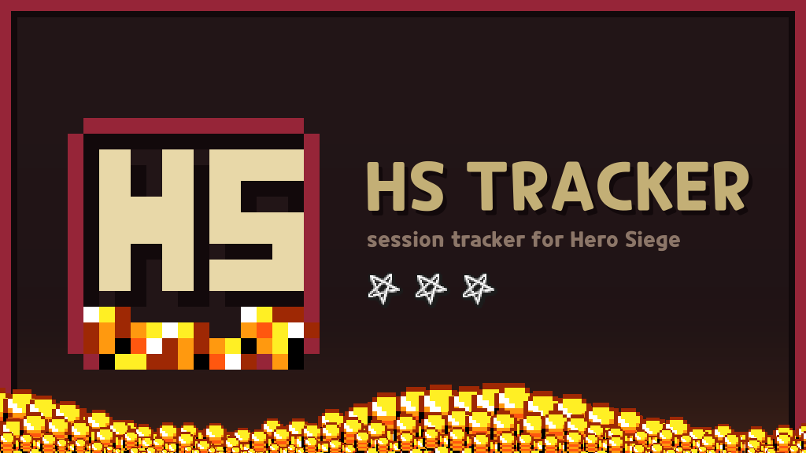
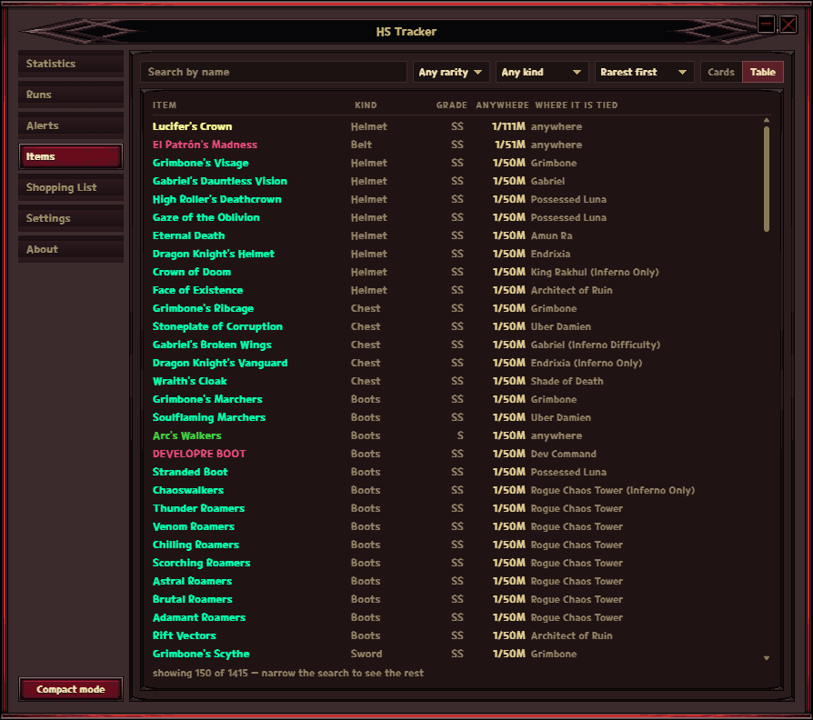
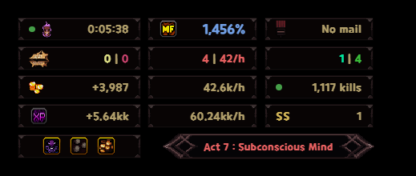
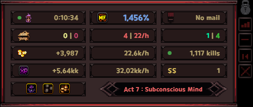

<p align="center">
  
</p>

<p align="center">
  Gold, experience, kills and every drop — counted while you farm,
  <br>in the game's own skin.
</p>

<p align="center">
  <a href="../../releases"><b>➡️ Download for Windows &amp; Linux ⬅️</b></a>
</p>

> [!NOTE]
> **How soon does it work when a new season starts?**
>
> About an hour, an hour and a half. That is how long it takes to rebuild the
> item tables and cut a release.


## What it does

| | |
| --- | --- |
| **Overlay** | A small always-on-top panel with the run so far. Lock it and it becomes click-through, so it never eats a click meant for the game. |
| **Statistics** | Gold, xp and kills per hour, drops by rarity, magic find, bosses and chests, what rolls better in the zone you are standing in, and the Satanic Zone with a countdown to the next rotation. |
| **Alerts** | One page: a sound per rarity, the grade a drop must reach, named lists of specific items with sounds of their own, the satanic zone rotating, and the announcement — all set side by side rather than three tabs apart. Alerts fire the moment an item hits the ground. |
| **Announcement** | A drop lands and the game's own loot pillar plays over the screen, wherever you have put it. It can follow the rarity switches or simply announce whatever your custom filter lists. |
| **Satanic Zone** | The rotation gets a chime and an announcement of its own — a rift that opens across the screen with the new zone and the buffs it rolled, drawn so it is never mistaken for a drop. Tick the buffs worth leaving a fight for and the rest pass in silence; tick none and every rotation is announced. |
| **Items** | Every named item, its drop chance, and the places it rolls better in. Search by name, rarity or kind. |
| **Runs** | Every finished session kept — the rates, the finds, where the time went. **Copy card** turns one into a picture you can paste into a chat. |
| **Pause** | By hand, or by itself after five quiet minutes, so a break does not end up in the per-hour figures. |
| **OBS** | The announcement window can stay on screen between drops, so OBS can capture it as a window source. |
| **Backup** | Export every setting — rarities, grades, the announcement, every filter and list, and the sound files themselves — to one file, and read it back on another machine. |
| **About** | The version you are running, who made it, and a button that asks GitHub whether a newer release is out. |
| **Discord** | Optional: while the game is open, your friends see the zone, the drops and the timer. |

It reads the game's network traffic. It never touches the game process, never
injects anything, and sends nothing anywhere — everything stays on your machine.
The one exception is the **About** section's update check, which asks GitHub for
the newest release and only when you press the button.

## Showcase

The app is a small set of pages behind the overlay: what happened this session,
what to shout about when it drops, what you are hunting, and the switches.

| Statistics | Alerts |
| --- | --- |
| Rates per hour, drops by rarity and grade, magic find, bosses and chests, and the Satanic Zone with its countdown. | One page in two columns: each rarity's sound and volume on the left with the announcement under it, the custom filter and its lists on the right. |
|  |  |

| Items | Shopping List |
| --- | --- |
| Every named item, what it takes to get one, and where it is worth farming. Cards or a table, whichever reads better. | The items you are actually after, so a drop you have been waiting weeks for is not one line among forty. |
|  |  |

### The overlay, locked and not

Locked, it is click-through: the mouse goes to the game and only the numbers are
drawn. Unlocked, it grows a frame, a grip to drag it by and the buttons that
reset or hide it — and that is the one state in which it can take a click the
game was meant to have.

| Locked | Unlocked |
| --- | --- |
|  |  |

Settings is the last page, and the least interesting: the four or five things
people change, with the rest a click away under **More settings**.


## Install

### Windows

Run the installer. It installs for the current user, so Windows never asks for
administrator rights.

HS Tracker needs [Npcap](https://npcap.com) to read the game's traffic. The
installer checks for it and opens the download page when it is missing. Install
it with the options it comes with, and in particular leave *Restrict Npcap
driver's access to Administrators only* unticked — with that on, HS Tracker is
refused the adapter and counts nothing.

Everything the app writes lives next to the executable, so the folder can be
copied to another machine as it is.

### Linux

```bash
sudo apt install ./HS\ Tracker_*_amd64.deb      # Debian, Ubuntu, Mint …
sudo dnf install ./HS\ Tracker-*.x86_64.rpm     # Fedora
```

Either package grants the app the right to capture during installation. Settings
live in `~/.config/hs-tracker`.

The AppImage runs anywhere but cannot carry that right, so it needs one line by
hand:

```bash
./HS\ Tracker_*.AppImage --appimage-extract     # gives ./squashfs-root
sudo setcap cap_net_raw=ep squashfs-root/usr/bin/hs-tracker
./squashfs-root/AppRun
```

## Using it

The tray icon is the control centre: click it to hide or bring back whatever was
last on screen. Right-clicking the overlay opens the same menu.

| | |
| --- | --- |
| Show / hide | tray click, or `Ctrl+Shift+O` |
| Overlay ⇄ dashboard | **Compact mode** in the sidebar, **Dashboard** in the overlay menu |
| Lock the overlay | the lock icon on hover, or `Ctrl+Shift+L` |
| Reset the session | the overlay button, the tray, or `Ctrl+Shift+R` |
| Pause the session | the clock in Statistics, the tray, or `Ctrl+Shift+P` |

Counting starts once the game reports your character, a moment after you enter a
zone. Gold, experience and kills only travel when the game saves, so between
saves those three sit still while drops keep arriving — that is the game, not a
stuck counter.

## Streaming it

The app draws four windows. Each is transparent and can be captured on its own:

| Window | What it is | On screen |
| --- | --- | --- |
| `HS Tracker — Overlay` | the compact panel | while you are in compact mode |
| `HS Tracker Ticker` | drop names, under the overlay | for a few seconds after a drop |
| `HS Tracker Flourish` | the announcement for a big drop, and for the zone rotating | while it plays |
| `HS Tracker` | the dashboard | while you are in dashboard mode |

### Capturing a window

1. Add a **Window Capture** and pick the window from the list.
2. Set **Capture Method** to **Windows 10 (1903 and up)** — that is the one that
   keeps the transparency.
3. Set **Window Match Priority** to **Window title must match**.

That third step matters. On any other setting OBS falls back to *another window
of the same type* when it cannot find the one you chose, and every window here is
the same type — so you get the dashboard instead of the overlay.

A window that is not on screen cannot be captured at all. The ticker and the
announcement come and go by design: their sources sit empty and fill when a drop
happens, which is what you want. The overlay is a different matter — it is hidden
while the dashboard is up, so its source stays empty until you switch back to
compact mode. For the announcement there is **Keep its window on screen so OBS
can capture it** in Settings, which leaves it there drawing nothing.

## If something does not work

**Send the log.** The app writes what goes wrong to `hs-tracker.log` beside its
settings — panics, and anything a panel throws. **About** gives the path and a
button that opens the folder. It is small and safe to paste: it holds errors, a
line saying which version started, and nothing about you.

**The numbers stay at zero.** The app has to be allowed to read network traffic:
on Windows that means Npcap, on Linux the packaged install does it for you and an
AppImage needs the `setcap` line above.

**The satanic zone alert came late, or not until I moved.** It arrives when the
game next asks the server where the zone is, and the game asks as part of saving.
Playing saves constantly, so while you are killing things the alert lands within
seconds of the rotation. Standing still saves nothing, so nothing asks — and the
rotation waits. Timed here across two real rotations: **thirteen seconds while
playing, twenty-four minutes standing away from the keyboard.**

Entering or reloading a zone makes the game ask straight away, which is why
moving appears to summon the alert. This one is not fixable from here: the app
reads the game's traffic and has no way to ask the server anything itself.

Zones rotate on the half hour, at :00 and :30 — Statistics counts down to the
next one, and that countdown is right whether or not the alert has arrived yet.

### On Linux

**The game covers the overlay.** Run Hero Siege **windowed** or **borderless**
rather than in exclusive fullscreen, and the overlay will stay put.

This is not something the app can win. Every Linux desktop puts the *active
fullscreen window* in a layer above the one that holds always-on-top windows, so
while the game is fullscreen no overlay of any kind can sit on top of it —
Discord's overlay fails there the same way. Asking for always-on-top is honoured
and still loses.

If you would rather keep exclusive fullscreen, KDE can settle it from its side:
*System Settings → Window Management → Window Rules*, add a rule matching Hero
Siege with the property **Fullscreen → Force → No**. The game still fills the
screen; it just stops claiming the top layer.

**There is no overlay at all.** A Wayland session cannot host one: an application
there may not place a window above another program's fullscreen window, read the
pointer outside itself or take global hotkeys. Settings offers **Enable the
overlay — restart through XWayland**, which brings all of it back and is
remembered for every later start. Hero Siege runs through XWayland too when it
runs through Proton, so the two meet in one X server.

**An NVIDIA card, and no window appears — just the tray icon.** WebKitGTK, which
draws every window here, composites through a DMA-BUF renderer that the
proprietary NVIDIA driver does not survive: its web process dies and the desktop
reports a crashed `WebKitWebProcess`. The app switches that renderer off by
itself when it finds the driver on the machine, so an up-to-date build should
simply work. If a window still refuses to appear, the heavier escape hatch is:

```bash
WEBKIT_DISABLE_COMPOSITING_MODE=1 hs-tracker
```

## Development

See [DEVELOPING.md](DEVELOPING.md).

## Credits

- The overlay is skinned with Hero Siege sprites. Hero Siege is © Panic Art
  Studios. This project is not affiliated with or endorsed by them.
- The protocol work builds on
  [hero-siege-stats](https://github.com/GuilhermeFaga/hero-siege-stats) and
  [Hero-Siege-Companion](https://github.com/DemonSkye/Hero-Siege-Companion).
- Item names, rarities and grades are generated from
  [hero-siege-helper](https://hero-siege-helper.vercel.app)'s datamined data and
  are not redistributed here.

Released under the [MIT license](LICENSE).
